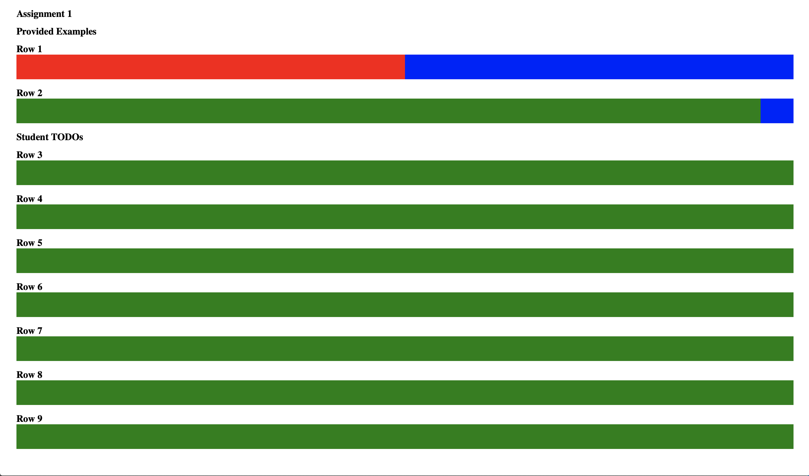
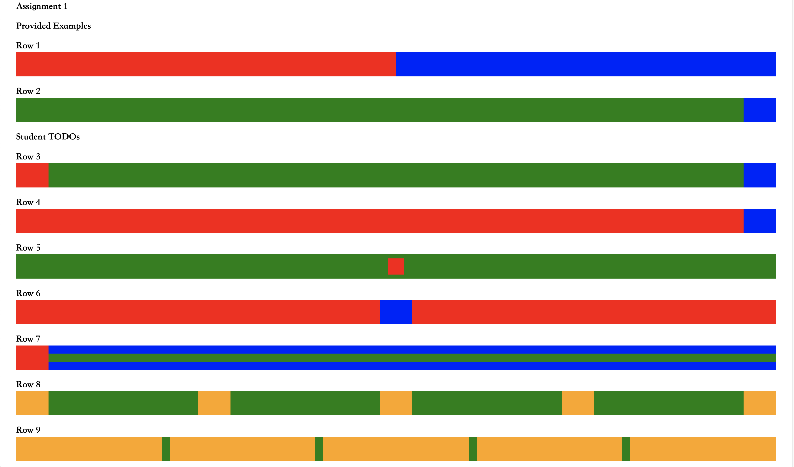
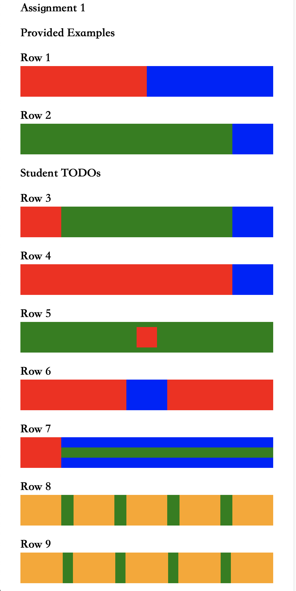

## CSS Styling
When developing the front-end with HTML and CSS code, there are three types of CSS that you can apply to your HTML web page. 

- Inline - Adding styling within the `style` attribute of the element
- Internal - Adding styling within the `<style>` tag
- External - Adding styling within a CSS file and linking to with a `<link>` tag

Inline styling can get pretty messy on larger projects. Internal styling improves upon this by moving the styles that you apply into a separate section within your code. But ideally, you would want to move your styling into a different file completely and link the sheet to your HTML page. This will help with readability, reduce redundancies in your code, and is just generally a good coding practice.

All CSS files end with the `.css` extention. These style sheets consist of a series of selectors, which you use to choose what to apply your styling to, and the actual styling. So the file will look something like this:

```
p {
    color: green
}

.example {
    font-size: 30px
}

div > h1 {
    color: red
}
```

Let's break these down. 

The `p` selector selects all `<p>` tags and applies the styling to those elements. If you want to apply the same styling to multiple tags, you can chain the selectors together with spaces (if you want to also apply it to `h1`, the selector would be `p h1`). 

The `.example` selector selects all elements with the `example` class name. These would be those with `example` as an element's `class` attribute. Similar to the element selectors, you are able to chain these to apply the stylings with different classes. Instead of spaces, these selectors would be separated with `.`. (ex. `.example.other` applies the styling to classnames `example` and `other`). You can also apply several classnames to a single elements. For example, `class="example other"` applies the styles associated with `example` and `other`.

Finally, the `div > h1` selector selects all `h1` elements that is a child of a `div`. So if your HTML looks like this:

```
<h1>Hello</h1>
<div>
    <h1>World</h1>
</div>
```

Only "World" would be styled.

Of course, this is just a small sample of all the selectors and styles that you can apply. If there is something specific that you want to style in a certain way, you should check out a reference sheet for CSS.

---

# Assignment

## Intro

Now that you understand some of the basics of HTML and CSS, let’s take a look at how to align HTML elements. There are multiple ways to align HTML elements, but in this part, we recommend using flexboxes as they are widely used in modern web development (for example BootstrapV4 is built on top of flexboxes).

## Resources 

Refer to this great webpage on how to use flexboxes: [CSS Flexbox Guide](https://css-tricks.com/snippets/css/a-guide-to-flexbox/).

Also feel free to use online resources such as Stack Overflow, MDN, W3, and Google for reference.

## Your Task

When you open the provided HTML file `part1/index.html` , it should look like this:



As you can see, there are 9 rectangles. The styling and makeup of the first two rectangles are already built for you. 

**Your task is to apply stylings and add div elements inside of the next 7 green rectangular blocks to create a webpage that looks like this:**



Note that these rectangular blocks should be *responsive*. Here is what they look like when the window is thinner:



## Row Information

3. For the third row, the red and blue end rectangles should remain the same width, and the green space should shrink.

    *Possible Approach: Have a div with a red background and a div with a blue background, both with fixed width. Use an appropriate value for Justify Content.*

4. For the fourth row, the blue end rectangle should remain the same width, and the red rectangle should shrink.

    *Possible Approach: Have a div with a red background and a div with a blue background. Have a fixed width on the blue div. Use Flex Grow.*

5. For the fifth row, the red square should remain the same size, but always remain in the center of the green rectangle.

    *Hint: Think about how to keep a div fixed size and how to align something in the absolute center of the parent element.*

6. For the sixth row, the blue rectangle should remain the same size, while the red rectangles should shrink. The blue rectangle should remain in the center of the row.

    *Hint: Use two red divs.*

7. For the seventh row, the red rectangle should remain the same width.

    *Hint: Nest divs and use background-color: transparent*

8. For the eighth row, the orange rectangles should remain the same size while the green space between them shrinks.

9. For the ninth row, the green space between the orange rectangles should remain the same width while the orange rectangles narrow.

## Additional Information

You should only have to use the div html element to complete this assignment. Also, none of the divs you create inside of the provided wrapper divs should have `background-color: green;`. But it is valid to specify non-green background colors for any divs, including the wrapper.

Try to style the boxes as closely to the solution image as possible don't worry about getting exact dimensions or rgb values. We care about what structure, CSS styles you used, and the dynamic behavior of the page. However just for reference,

- The color of the boxes we used are `background-color: red` , `blue` , and `orange`

- Some width/height values we used are `20px`, `40px`, `80px`